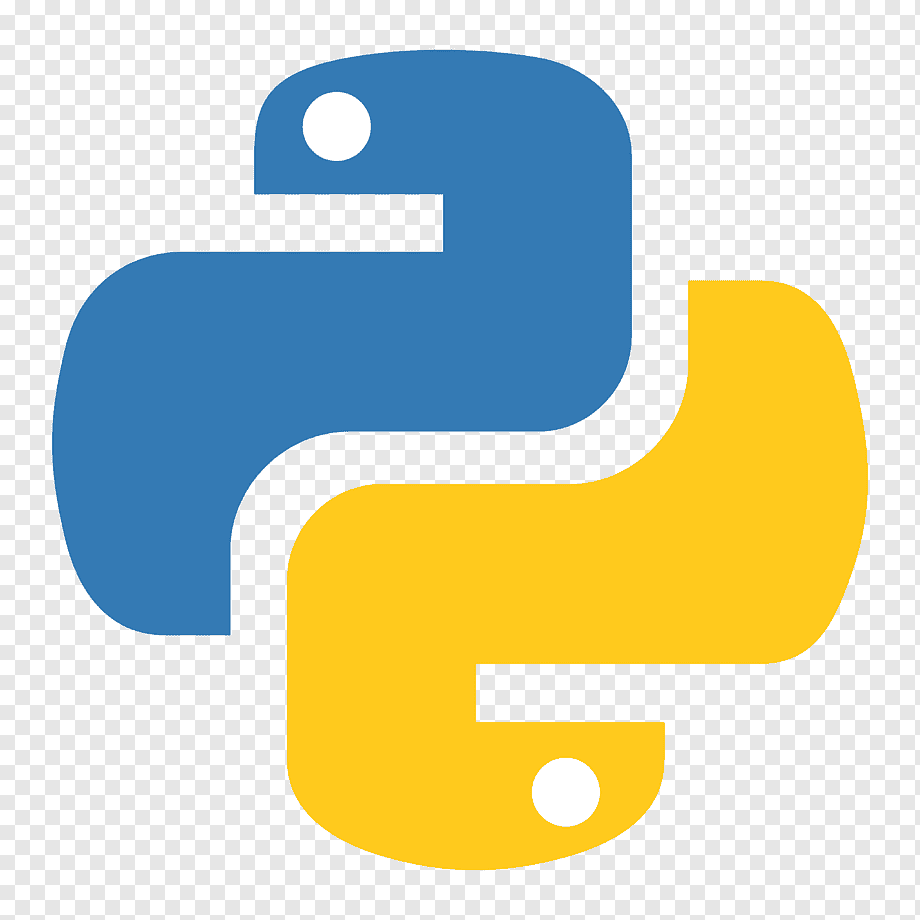

### Hey 👋, I'm Bart

- 🔭 I’m currently working on my master thesis on batch detection in object-centric event data
- 🌱 I have experience in applying large language models in process mining with Streamlit
- ⚡ I love sports, especially football, volleyball, snowboarding, climbing, and dancing! 👯
- 🎹 Fun fact: I graduated from a first degree music school and play piano
- 📫 How to reach me: bartek.binda.misc at gmail.com

### Languages and Tools: 

<!-- ### 📊 My GitHub Stats

 -->
